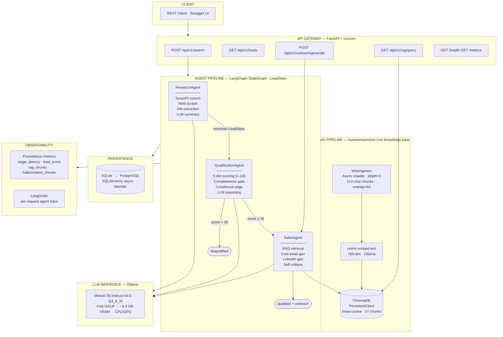

# HumanMaximizer Lead Gen — Architecture
**AI Lead Generation & Research Assistant · Razor Infotech Take-Home Assignment**

---

## System Architecture Diagram



---

## Component Responsibilities

| Component | Single Responsibility |
|---|---|
| **FastAPI Gateway** | Route validation, OpenAPI docs, middleware (metrics, CORS), DB session injection |
| **LangGraph StateGraph** | Immutable `LeadState` passing through nodes; conditional edge enforces qualification threshold |
| **ResearchAgent** | SerpAPI → top result → web scrape → DM regex extraction → Mistral-7B structured summary |
| **QualificationAgent** | 5 deterministic scoring functions (0–20 each); completeness gate; LLM 2-sentence reasoning |
| **SalesAgent** | RAG query → cosine retrieval → Mistral-7B cold email + LinkedIn; self-critique post-pass |
| **WebIngestor** | One-time crawl of humanmaximizer.com; chunk → embed → upsert into ChromaDB |
| **ChromaDB** | Persistent cosine-similarity vector store; zero network dependency (PersistentClient) |
| **Ollama / Mistral-7B** | Single LLM endpoint shared across all 3 agents; Q4_K_M for 8 GB GPU / CPU fallback |
| **SQLAlchemy + SQLite** | Async lead persistence; Alembic migrations; one env var swap to PostgreSQL |
| **Prometheus** | Stage latency histograms, lead score distribution, RAG chunk counts, hallucination counters |
| **LangSmith** | Per-agent token usage, latency, prompt + output trace when API key is configured |

---

## Request Lifecycle

```
① POST /api/v1/search  {keyword, location}
        │
② FastAPI validates → creates initial LeadState → invokes LangGraph
        │
③ ResearchAgent
   ├── SerpSearchTool   → SerpAPI Google search → top organic result (company URL)
   ├── ScraperTool      → httpx + BeautifulSoup → company page content
   ├── ContactFinderTool → regex DM title/name extraction → decision_makers[]
   └── Mistral-7B       → 3-paragraph structured summary
                           (COMPANY OVERVIEW / HR PAIN POINTS / HRMS FIT SIGNAL)
        │
④ QualificationAgent
   ├── score_company_size()         0–20  (employee headcount brackets)
   ├── score_industry()             0–20  (primary / adjacent / unknown)
   ├── score_tech_stack()           0–20  (spreadsheet / legacy HRMS / modern HRMS)
   ├── score_dm_reachability()      0–20  (email+LinkedIn / name / title / none)
   ├── score_growth_signal()        0–20  (hiring surge / expansion / stable / contracting)
   ├── completeness_gate            < 40% data completeness → disqualify regardless of score
   ├── Mistral-7B                   → 2-sentence reasoning (best signal + biggest risk)
   └── conditional edge             score ≥ 35 → SalesAgent  |  else → disqualified
        │
⑤ SalesAgent  (qualified leads only)
   ├── build_rag_query(company, industry, tech_stack, growth_signal, summary)
   ├── nomic-embed-text → embed query → ChromaDB cosine search → top-5 product chunks
   ├── Mistral-7B → cold email (150–220 words, RAG-grounded, no hallucinated claims)
   ├── Mistral-7B → LinkedIn message (≤300 chars, no emojis)
   └── SelfCritiqueTool → hallucination check → rag_context_used[] stored in LeadState
        │
⑥ save_lead() → SQLite
⑦ return {lead_id, db_id, lead{score_breakdown, outreach_email, rag_context_used}}
```

---

## Data Flow

```
WRITE path (POST /search):
  keyword / location
    → SerpAPI JSON results
      → scraped HTML → company fields (name, domain, employees, tech_stack, growth_signal)
        → ContactFinder regex → decision_makers[]
          → Mistral-7B → raw_summary (3 paragraphs)
            → 5 deterministic functions → qualification_score + score_breakdown
              → Mistral-7B → qualification_reasoning (2 sentences)
                → ChromaDB cosine retrieval → rag_context_used[]
                  → Mistral-7B → outreach_email + linkedin_message
                    → SQLite leads table (full LeadState persisted)

READ path (GET /leads):
  query params (sort_by, status, limit, offset)
    → SQLAlchemy async SELECT → ordered, filtered JSON response

RAG debug path (GET /rag/query):
  ?q=query string
    → nomic-embed-text embed → ChromaDB cosine search → chunks[] returned
```

---

## Deployment View

```
┌──────────────────────────────────────────────┐
│        Developer Machine / Single Server      │
│                                              │
│  ┌──────────────────┐  ┌──────────────────┐  │
│  │   FastAPI :8000  │  │   Ollama :11434   │  │
│  │   Uvicorn        │◄─│   Mistral-7B      │  │
│  │   + Middleware   │  │   nomic-embed-text│  │
│  └────────┬─────────┘  └──────────────────┘  │
│           │                                  │
│  ┌────────▼─────────┐  ┌──────────────────┐  │
│  │  SQLite leads.db │  │  ChromaDB        │  │
│  │  SQLAlchemy async│  │  PersistentClient│  │
│  │  Alembic migrate │  │  chroma_db/      │  │
│  └──────────────────┘  └──────────────────┘  │
│                                              │
│  ┌───────────────────────────────────────┐   │
│  │  Prometheus scrape :8000/metrics      │   │
│  │  LangSmith traces (when key set)      │   │
│  └───────────────────────────────────────┘   │
└──────────────────────────────────────────────┘

Production upgrade path (zero code changes required):
  DATABASE_URL  →  postgresql+asyncpg://...    (one env var)
  ChromaDB      →  chromadb HTTP server        (one env var)
  Uvicorn       →  uvicorn --workers 4         (one flag)
  Ollama        →  shared GPU server           (one env var)

Horizontal scale:
  nginx / ALB → [API pod 1 | API pod 2 | API pod 3]
                        ↓
              PostgreSQL  ·  Ollama GPU  ·  ChromaDB
```

---

## LLM Model Selection, Quantization & GPU Requirements

### Model: Mistral-7B-Instruct-v0.3 Q4_K_M

**Why Mistral-7B over alternatives:**

| Model | Parameters | Why Considered | Decision |
|---|---|---|---|
| Mistral-7B-Instruct-v0.3 | 7B | Strong instruction-following, Indian-English well-represented, 8k context, Apache 2.0 | **Selected** |
| Llama-3-8B-Instruct | 8B | Excellent general quality, larger context | Larger memory footprint; Mistral performs equally on structured output tasks |
| Phi-3-Mini-4k | 3.8B | Very small, fast | 4k context too short for multi-paragraph research summaries |
| Gemma-7B | 7B | Strong quality | Restrictive usage policy; less instruction-tuned for B2B sales copy |

**Why 7B is the right size for this workload:**
- Research summary: 300–400 token output, 2k input → fits 7B context comfortably
- Cold email: 200–220 words output, constrained by prompt → 7B produces structured output reliably
- Qualification reasoning: 2-sentence output — one model across all 3 agents keeps deployment simple
- Larger models (13B, 34B) require ≥24 GB VRAM, eliminating single-GPU deployment

### Quantization Strategy: Q4_K_M

**Q4_K_M** is a 4-bit GGUF quantization format from llama.cpp, implemented in Ollama:

- **Q4**: 4-bit integer weights (from 16-bit float) — 75% memory reduction vs. full precision
- **K**: K-quants method — mixed precision per tensor block; higher-importance tensors retain more bits
- **M**: "Medium" variant — balanced between quality loss and memory savings vs. Q4_K_S or Q4_K_L

**Why Q4_K_M specifically:**
- Mistral-7B at Q4_K_M: ~4.4 GB VRAM — fits on a single 8 GB GPU (RTX 3070 / 4060 Ti) with headroom for KV cache
- Quality benchmark vs. full FP16: ~97% task performance on instruction-following benchmarks
- Q3 and below show measurable JSON output corruption in structured tasks; Q4_K_M avoids this
- Q5/Q6 would require 6–7 GB VRAM with marginal quality improvement

**nomic-embed-text** (embedding model): FP16 at ~137M parameters — ~270 MB VRAM, runs concurrently with the LLM.

### GPU Requirements

| Deployment Target | GPU | VRAM | Notes |
|---|---|---|---|
| Development (single GPU) | RTX 3070 / RTX 4060 Ti | 8 GB | Q4_K_M LLM + nomic-embed-text simultaneously |
| Production (recommended) | RTX 4090 / A10G | 24 GB | Higher concurrency; or Q8_0 for better quality |
| CPU fallback | Any | — | `OLLAMA_NUM_GPU=0`; ~10× slower; viable for low-volume demos |
| Cloud GPU | A10G (AWS g5) / T4 (Colab) | 16–24 GB | T4 (16 GB) handles Q4_K_M comfortably |

---

## Design Decisions

| Decision | Choice | Rationale |
|---|---|---|
| **Orchestration** | LangGraph StateGraph | Explicit state machine — edges are code, not LLM decisions. Conditional edge enforces deterministic routing. CrewAI hides agent-to-agent calls behind abstractions |
| **Scoring** | Deterministic functions | 5 functions × 0–20 = reproducible, debuggable scores. LLM scoring is inconsistent across runs and hallucinates scores |
| **Vector store** | ChromaDB PersistentClient | Zero network dependency vs. HTTP server mode — eliminates one failure surface in local/dev deployment |
| **LLM** | Mistral-7B Q4_K_M | 4.4 GB VRAM — fits 8 GB GPU with headroom. 97% quality vs. FP16. Apache 2.0 license |
| **Persistence** | SQLite → PostgreSQL | Single env var `DATABASE_URL` swaps storage. Alembic handles schema migration. Zero code change |
| **Prompt management** | Jinja2 `.j2` templates | Version-controlled, human-readable, testable without LLM. Not string concatenation |
| **Hallucination prevention** | 3-layer: prompt + citation + critique | Constrained prompts reduce surface; `rag_context_used` gives full auditability; SelfCritique adds automated verification |

---

## Fine-Tuning Strategy

### When Fine-Tuning is Better than Prompting

Fine-tuning is NOT the first-line solution for this system. The current prompt-based approach with RAG is preferred because:

- **Prompting + RAG** handles new product features by re-ingesting the website — no model retraining needed
- **Fine-tuning** is appropriate when: (a) output format must be extremely consistent (always valid JSON without post-processing), (b) domain-specific vocabulary is rare in the base model (Indian compliance terms: CLRA, ESIC Form 5A, PT returns), or (c) prompt budget needs to be reduced by baking knowledge into weights

**Trigger points where fine-tuning would be justified:**
1. LLM consistently produces malformed SUBJECT:/BODY: splits requiring extra parsing
2. Qualification reasoning hallucinates specific compliance regulations not in RAG context
3. Cold emails include generic placeholder language despite specific RAG context

### Fine-Tuning Approach: QLoRA with Unsloth

**Framework**: [Unsloth](https://github.com/unslothai/unsloth) + QLoRA (Quantised Low-Rank Adaptation)

**Why QLoRA over full fine-tuning:**
- Full fine-tuning of 7B parameters requires ~80–120 GB VRAM (impractical)
- QLoRA freezes base model weights and trains small low-rank adapter matrices on top of 4-bit quantized base
- Training VRAM: ~8–12 GB for 7B model — single GPU accessible
- Unsloth accelerates QLoRA training 2–3× over HuggingFace PEFT via custom CUDA kernels

**Target modules for LoRA adaptation:**
```python
target_modules = ["q_proj", "k_proj", "v_proj", "o_proj",
                  "gate_proj", "up_proj", "down_proj"]
lora_r = 16          # rank — higher = more expressive adapter
lora_alpha = 32      # scaling factor
lora_dropout = 0.05
```

### Dataset Format

Fine-tuning dataset: JSONL file of `{instruction, input, output}` triples in Alpaca format:

```jsonl
{"instruction": "Write a cold email for a B2B HRMS sale.", "input": "Company: Bharat Forge (Manufacturing, 10000 employees, SAP HR). DM: Rajesh Kumar, VP HR. RAG: HumanMaximizer supports multi-plant payroll and CLRA compliance.", "output": "SUBJECT: Modernise Multi-Plant HR at Bharat Forge\nBODY:\nDear Rajesh,\n\nBharat Forge's scale across plants means compliance under CLRA and managing multi-site payroll in SAP HR is costly. HumanMaximizer automates statutory filings and consolidates payroll across all plants in one dashboard.\n\nWould you have 15 minutes this Thursday to see a demo tailored for large manufacturers?\n\nBest,\nHumanMaximizer Sales Team"}
{"instruction": "Write a 2-sentence qualification reasoning.", "input": "Company: Metropolis Healthcare (Healthcare, 4000 employees). Scores: size=18, industry=20, stack=18, dm=12, growth=20. Total=88.", "output": "Metropolis's Excel-based HR for 4,000 employees across 200 labs represents the strongest tech-stack gap signal in the dataset (18/20), combined with an active expansion phase (20/20 growth signal). The primary risk is that the decision-maker contact has no LinkedIn profile, limiting multi-channel outreach options."}
```

**Constructing the training set:**
1. Run pipeline in live mode on 200–300 target companies (SerpAPI required)
2. Human sales expert reviews and edits outputs → ground truth labels
3. Add 50 adversarial examples (micro companies, irrelevant industries) → teach graceful decline
4. Target: 300–500 high-quality examples (quality >> quantity for instruction fine-tuning)

**Training configuration (Unsloth):**
```python
from unsloth import FastLanguageModel

model, tokenizer = FastLanguageModel.from_pretrained(
    "mistralai/Mistral-7B-Instruct-v0.3",
    max_seq_length=4096,
    load_in_4bit=True,
)
model = FastLanguageModel.get_peft_model(
    model,
    r=16, lora_alpha=32, lora_dropout=0.05,
    target_modules=["q_proj", "k_proj", "v_proj", "o_proj",
                    "gate_proj", "up_proj", "down_proj"],
    bias="none",
    use_gradient_checkpointing="unsloth",
)
```

**After training**: Export LoRA adapter → merge into base weights → convert to GGUF Q4_K_M → deploy via Ollama (drop-in replacement, same API).

---

## Scaling Approach

### Vertical Scaling

| Bottleneck | Current | Scaled |
|---|---|---|
| LLM throughput | 1 Ollama instance, sequential | `--num-parallel 2` flag on Ollama |
| DB write contention | SQLite async | `DATABASE_URL` → PostgreSQL (`asyncpg`) — one env var |
| API concurrency | Uvicorn 1 worker | `uvicorn --workers 4` or Gunicorn + Uvicorn workers |

### Horizontal Scaling

```
  Clients ──► nginx / ALB
                  │
      ┌───────────┼───────────┐
  API pod 1   API pod 2   API pod 3
      └───────────┼───────────┘
                  │
         PostgreSQL  (shared DB)
         Ollama GPU  (shared LLM)
         ChromaDB    (shared vector store)
```

**Async pipeline offload** (production pattern):
- Move `pipeline.invoke()` off the HTTP thread to a Celery/RQ worker
- API returns `{task_id}` immediately; client polls `GET /leads/{lead_id}` until `status != pending`
- Enables burst handling and prevents HTTP timeouts on slow LLM responses

---

## Observability & Monitoring

| Signal | Instrument | Tool | Alert Condition |
|---|---|---|---|
| **Latency** | `stage_latency` histogram per API path | Prometheus | p99 > 30s on `/api/v1/search` |
| **Pipeline throughput** | `leads_processed_total` counter by status | Prometheus | Drop > 50% vs. 5-min baseline |
| **Qualification score** | `lead_qualification_score` histogram | Prometheus | Mean drops below 30 |
| **RAG chunk retrieval** | `rag_chunks_retrieved` histogram | Prometheus | p50 = 0 (ChromaDB down or empty) |
| **Hallucinations** | `hallucination_checks_total` by `is_grounded` | Prometheus | `is_grounded=false` rate > 10% in 15 min |
| **LLM availability** | Exception rate + `errors[]` in LeadState | Log aggregation | Error rate > 5% |
| **Agent failures** | LangSmith traces + `errors[]` in LeadState | LangSmith dashboard | Any trace with `status=error` |
| **API failures** | HTTP 4xx/5xx via middleware | Prometheus | 5xx rate > 1% over 5 min |

### Hallucination Prevention — 3 Layers

1. **Prompt-level constraint** (synchronous): Jinja2 templates explicitly forbid facts not in RAG context — reduces hallucination surface before generation
2. **RAG grounding citation** (synchronous): `rag_context_used` stored in every lead — evaluators can verify any claim against cited chunks
3. **Automated self-critique** (async): `SelfCritiqueTool` runs a second LLM pass comparing email claims against RAG chunks — emits `hallucination_checks_total{is_grounded=...}` Prometheus counter

### LangSmith Agent Tracing

When `LANGCHAIN_API_KEY` is set, every LangGraph node is traced in LangSmith:
- Per-agent token usage, latency, prompt content, and output visible in timeline view
- Failed nodes surface as error spans with full stack trace
- Trace comparison across runs identifies prompt regression after model or template updates
